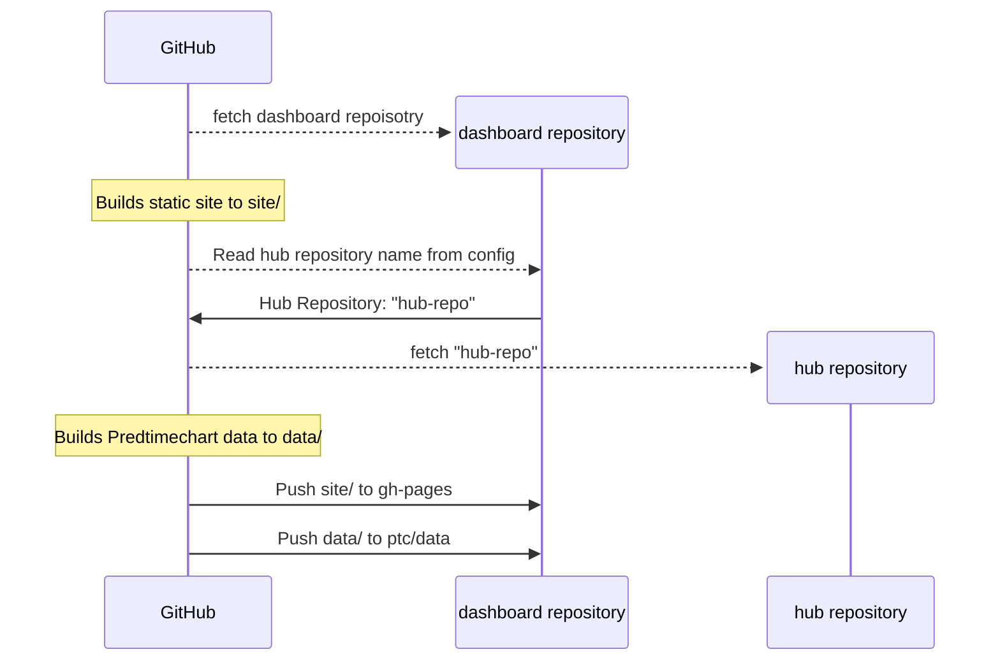
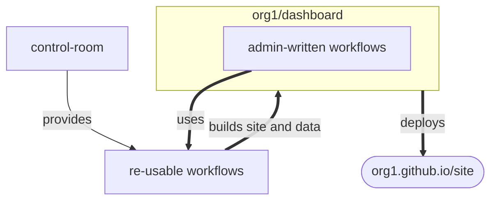
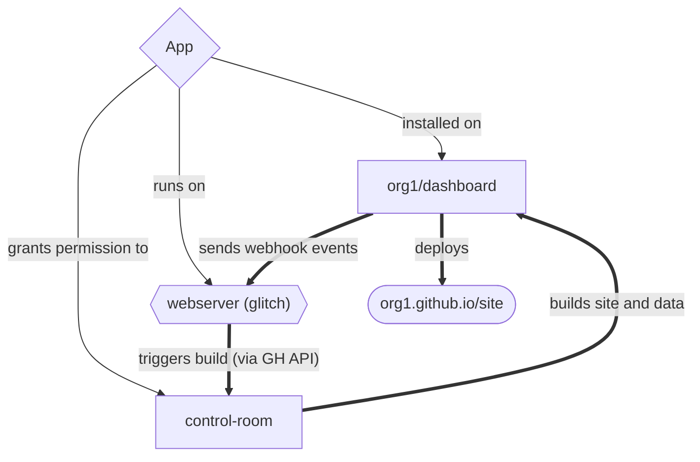

# Project Poster: The Hubverse Dashboard

- Date: 2024-12-12

- Owner: Evan L. Ray

- Team: Matthew Cornell, Zhian N. Kamvar, Evan L. Ray

- Status: in progress

## ❓ Problem space

### What are we doing?

Developing a theme-able and low-maintenance dashboard for hub admins that
will publish a Predtimechart vizualization, Evaluations, and any associated
markdown contents when each round closes.

Because hubs can be complex, in our initial development push we are
restricting this to hubs that have step-ahead quantile predictions. This
aligns with existing functionality in predtimechart and simplifies evaluations.

### Why are we doing this?

We are supporting timely communication of modeling hub results to
decision-makers and exploration of modeling results by modelers and
hub administrators.

Many, but not all hub administrators are proficient with GitHub or static sites.
For example, when the idea of a dashboard site was brought up to the community,
one adminstrator mentioned that this would be a huge help, but her team had no
capacity for maintaining another piece of infrastructure.

Similar websites exist for established efforts:

- https://respicast.ecdc.europa.eu/forecasts/
- https://covid19forecasthub.org/

However, the machinery to build these websites and visualizations was not
trivial. They required knowledge of R Markdown, JavaScript, and GitHub Actions
and that was just for the website.

These sites are run in conjunction with active periods for modeling hubs and it
should be possible for a hub admin to "set it and forget it"---that is, they 
should be able to add the information they need to add and not have to touch it
for another several momnths.

### What are we _not_ trying to do?

We are _not_ trying to make a generalizable dashboard that can accommodate all
hub types.

### How do we judge success?

A successful outcome is a deployable website that can:

 - display an up-to-date predtimechart visualization with data from a specified hub
 - display an evaluation report of model outcomes from the same specified hub
 - include custom markdown pages to describe the purpose of the hub
 - be customizable wrt to theme
 - automatically be built when a modeling round closes
 - be built on demand
 - does not require knowledge of anything more than Markdown, YAML, and GitHub Workflows
 - render equations
 - be independent from a hub

### What are possible solutions?

There are four pieces that are required for success: 

1. website generator,
2. predtimechart vis (or similar),
3. evaluations dashboard, and
4. the orchestration of these tools for continuous deployment

Each of the elements should be independent.

#### 1. website generator

 - Static Site Generator template or theme (one of the following):
   - Ship a static site generator (Hugo, Jekyll)
   - Ship a _theme_ for a static site generator
   - Readthedocs
   - Quarto
   - R Markdown website
 - Docker container as a method to encapsulate a static site generator with
   default JavaScript and CSS themes---paired with a custom template
 - Streamlit for generating webapp dynamically

#### 2. predtimechart vis

predtimechart is a javascript app that uses plotly.js to render plots.

It requires the user to provide a `fetchData` function that can be used to retrieve model output data (predictive quantiles) and target data (time series format).

To support that, we need:
 - a way build these data objects
    - installable python app
 - a place where the data will be stored
    - S3 bucket
    - github pages branch of the github repo used for the dashboard
    - Another branch on a github repo used for the dashboard

#### 3. evaluations dashboard

There are two pieces to the dashboard:

1. Creation of score data
2. The website itself

For score data, we will write functionality in R to compute scores after the close of each modeling round when target data become available and cache the scores for later retrieval by the process that's used to create the web app.

- We will use R to compute scores because there is existing functionality for score computation in the hubverse in the hubEvals package
- Saving score data:
    - S3 bucket
    - github pages branch of the github repo used for the dashboard
    - Another branch on a github repo used for the dashboard

The interactive website:
- R markdown document, quarto document, or similar that pre-computes all tables/figures used to display scores.
- Javascript app running in client side browser fetches data as needed and generates plots/etc. This is similar to predtimechart.
- Web app with server-side logic to render tables and/or figures, e.g. using Shiny or Streamlit
- webR or webpy runs R or python in the browser to dynamically create figures and tables

#### 4. orchestration

 - GitHub workflows distributed to hub adminstrators (similar to [hubverse-actions](https://github.com/hubverse-org/actions))
 - GitHub App that controls centralized GitHub workflows (similar to [the r-universe](https://github.com/r-universe-org/control-room))

## ✅ Validation

### What do we already know?

#### Website

 - this is a small site that will be generated several times per week, so build speed is not essential
 - there are over 400 static site generators, and they all interpret markdown a little differently
 - quarto has the closest markdown syntax to GitHub
 - readthedocs is mostly plug-and-play (no deployment workflow), but the structure is not simple.
 - all static site generator templates are complex in some way
 - docker can provide an abstraction for any static site generator we want
 - quarto documents can be easily themed

#### Evaluations

 - R markdown documents to precompute scores and tables generate very large HTML files that take a long time to load.
 - If we use a static website, we are unable to use a service like shiny or streamlit

#### Orchestration

 - GitHub provides unlimited free workflow runs for all public repositories
 - GitHub allows for [re-usable workflows](https://docs.github.com/en/actions/sharing-automations/reusing-workflows) that work on a job-level.
 - GitHub can produce artifacts from workflow runs that can be passed between jobs. 
 - Distributed workflows have been established to work as long as administrators understand GitHub workflows
   - (example) the hubverse distributed workflows sporadically require updates from the hub administrators
   - this requires extra communication directly with administrators
 - an app-based workflow can be an alternative for admins who are uncomfortable with github workflows
   - (example) the r-universe is an opt-in process that requires little to no effort from package maintainers
   - this requires extra maintenance of JavaScript code
 - a GitHub app can be written with probot and hosted on glitch.io for free (up to 1000 hours per month)

### What do we need to answer?

#### Orchestration

 - What are the trade-offs in terms of features vs engineering complexity and
   maintainability for solutions based on: 
   - GitHub workflows distributed to hub administrators and
   - a GitHub app that controls centralized GitHub workflows?
 - What value do we place on these trade offs?

TODO: evaluations-related.

## 👍 Ready to make it

### Proposed solution

#### Website

We have built a Docker container that builds a website based off of our custom
template and is configured by a custom `site.yml` configuration file, which is
a simplified form of a `_quarto.yml` file. During build time, it inserts the
predtimechart vis and uses Quarto on the backend.

 - [Docker container: hub-dash-site-deployer](https://github.com/hubverse-org/hub-dash-site-deployer)
 - [Website template: hub-dashboard-template](https://github.com/hubverse-org/hub-dashboard-template)

#### Predtimechart vis

We have built a python app that generates predtimechart forecast and target data
from a hub and a `predtimechart-config.yml` file. This is installable as a CLI
app. 

 - [Predtimechart vis: hub-dashboard-predtimechart](https://github.com/hubverse-org/hub-dashboard-predtimechart)

#### Evaluations

TODO

#### Orchestration

We have built a centralized set of GitHub workflows that will build the website
and the vis data separately and store them in separate branches of the dashboard
repository. Dashboard repositories can use this by installing the GitHub App on
to the dashboard repository, giving the app permission to write to the repository.
We can store the app credentials in the central repository and use them to 
generate the site and push back to the dashboard repository. 

The websites and/or data are built in two ways:

1. on a schedule (via the central repository)
2. on demand (via webhook to the app that triggers the central repository)

 - [Centralized workflows: hub-dashboard-control-room](https://github.com/hubverse-org/hub-dashboard-control-room)
 - [App: hubDashboard](https://github.com/apps/hubDashbaord)
 - [Glitch hosted instance of hubDashboard](https://glitch.com/~crystal-glimmer-path)

### Visualize the solution

#### General Workflow

The general workflow to generate the site and data looks like this.
This can be controlled either from a centralized or distributed workflow. 

#### Re-usable Workflows

This is how reusable workflows would work, the administrator would compose a workflow 
and reuse our reusable workflows:

#### App-based Workflows

An app-based workflow removes the responsibility from the admin by using the
workflows inside the control-room repository. Because the app gives write
permissions, the control room can act _as_ the dashboard repository.

