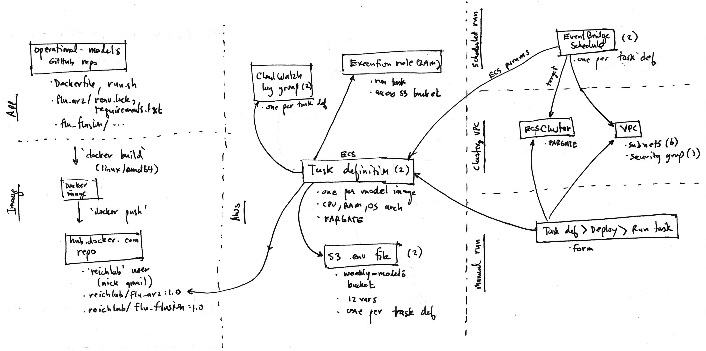

# Project Poster: Use IaC to manage the lab's AWS resources

- Date: 2025-01-07
- Owner: reichlab
- Team: Becky, Evan, Matt, Nick, Zhian
- Status: draft

## Problem description

The lab uses AWS resources for multiple projects, including [operational models](https://github.com/reichlab/operational-models), which contains our latest effort at automating Reichlab models via Docker containers, and some one-off S3 buckets that are used to store data (e.g., infectious-disease-data and covid-clade-counts). To date, AWS resources have been created by hand via the AWS console, which poses some risks to the lab:

- updating is tedious and error-prone
- is only understood by one or two lab members
- there is no centralized documentation that enumerates the resources and how to manage them
- likely could be cleaned up (e.g., removing the security group's inbound SSH/22 rule), but doing so could break other resources

This situation will only become worse in light of upcoming technical staff decreases.

## Project goal

Our goal is to:
1. enumerate [Possible solutions](#possible-solutions) to implementing a documented way to enumerate and manage AWS resources (ideally one that generates a log or trail of changes over time),
2. [evaluate and choose](#evaluation-approach) the best that meets our needs, and
3. implement that choice

## Possible solutions

So far we envision these possible solutions:

- keep using the AWS console to create and update cloud resources; create documentation about what each component is used for, including a changelog
  - pros: already familiar with the solution
  - cons: high learning curve for new people. not automated/reproducible. making resource changes requires updating docs
- a script that creates resources via AWS CLI or API
  - pros: simpler than a full on IaC solution 
  - cons: script must explicitly manage things like renaming resources, deleting existing ones if script is run from scratch, etc. (a full on IaC solution does these for you)
- full on IaC solution such as https://www.pulumi.com/ or an AWS-based one (there seems to be many - see https://aws.amazon.com/what-is/iac/ )
  - pros: takes care of creating, updating, tracking changes, etc. could be consistent with Hubverse-based IaC solution
  - cons: steep learning curve. relies on third party solution. possibly expensive

## Evaluation approach

Once we've enumerated possible solutions then we will evaluate them to choose the best for us. The choice should balance:

- features (must meet our needs)
- learning curve (solutions that leverage lab experience are better)
- cost (lower cost solutions are better)
- understandability to lab members (more understandable solutions are better)

After that we will implement the chosen solution by creating a working infrastructure to "dry run" our [flu_ar2](https://github.com/reichlab/operational-models/tree/main/flu_ar2) model and then judging how it went, both process and end product.

## Current infrastructure

(Given that our current AWS infrastructure is undocumented, we capture it here for reference.)

 gives an overview of the AWS resources currently used to run our models.

TODO: Details about each box in the diagram. Here's a partial description from slack:

- **Docker image**: I've built and pushed an AWS-compatiable image to dockerhub: reichlab/flu_ar2:1.0. It implements the generalized scheme you and I discussed yesterday where the same Dockerfile and run.sh can apply to different models ( https://github.com/reichlab/operational-models ). Recall that it's parameterized via environment variables passed on the command line (local dev) or in a .env file (local dev or AWS).
- **ECS cluster**: Configures AWS_Fargate (serverless container running) to run ECS task definitions (i.e., container images). I use this cluster for all lab task definitions. weekly-models
- **Task definition for the flu_ar2 model**: Specifies the above Docker image, an S3 environment file for it, logging, and how to run it including cpu, memory, and OS. flu-ar2-model:3 . Looking at the JSON might be useful.
- **Task execution role**: Permits the task to execute and to access the S3 env file. ecsTaskExecutionRole
- **Environment file for the task**: An S3 object that's input to the above task definition. Includes all the variables required by our operational-models Dockerfile and run.sh setup. flu_ar2.env.
- **EventBridge schedule**: A cron-style schedule for executing the task. flu-ar2-model
