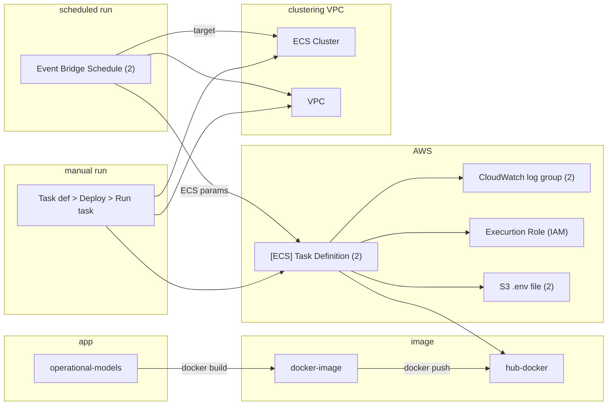

# Project Poster: Use IaC to manage the lab's AWS resources

- Date: 2025-01-07
- Owner: reichlab
- Team: Becky, Evan, Matt, Nick, Zhian
- Status: draft

## Problem description

The lab uses AWS resources for multiple projects, including [operational models](https://github.com/reichlab/operational-models), which contains our latest effort at automating Reichlab models via Docker containers, and some one-off S3 buckets that are used to store data (e.g., infectious-disease-data and covid-clade-counts). To date, AWS resources have been created by hand via the AWS console, which poses some risks to the lab:

- updating is tedious and error-prone
- is only understood by one or two lab members
- there is no centralized documentation that enumerates the resources and how to manage them
- likely could be cleaned up (e.g., removing the security group's inbound SSH/22 rule), but doing so could break other resources

This situation will only become worse in light of upcoming technical staff decreases.

## Project goal

Our goal is to:

1. enumerate [Possible solutions](#possible-solutions) to implementing a documented way to enumerate and manage AWS resources (ideally one that generates a log or trail of changes over time),
2. [evaluate and choose](#evaluation-approach) the best that meets our needs, and
3. implement that choice

The scope for this poster is #1 and #2, which will lead to #3 via other means (RFC, LDR, new repo, etc.)

## Possible solutions

So far we envision these possible solutions:

- keep using the AWS console to create and update cloud resources; create documentation about what each component is used for, including a changelog
    - pros: already familiar with the solution
    - cons: high learning curve for new people. not automated/reproducible. making resource changes requires updating docs. no automated changelog
- a script that creates resources via AWS CLI or API
    - pros: lower learning curve than a full on IaC solution if the number of AWS resources is low. changelog via VCS
    - cons: script must explicitly resources, their dependencies (including creation order), etc. (a full on IaC solution does these for you)
- full on IaC solution such as https://www.pulumi.com/ or an AWS-based one (there seems to be many - see https://aws.amazon.com/what-is/iac/ )
    - pros: takes care of creating, updating, tracking changes, etc. could be consistent with Hubverse-based IaC solution
    - cons: steep learning curve. relies on third party solution. cost (but might be inexpensive for small or open source projects)

## Evaluation approach

Once we've enumerated possible solutions then we will evaluate them to choose the best for us. The choice should balance:

- features (must meet our needs)
- learning curve (solutions that leverage lab experience are better)
- cost (lower cost solutions are better)
- understandability to lab members (more understandable solutions are better)

After that we will implement the chosen solution by creating a working infrastructure to "dry run" our [flu_ar2](https://github.com/reichlab/operational-models/tree/main/flu_ar2) model and then judging how it went, both process and end product.

## Current infrastructure

(Given that our current AWS infrastructure is undocumented, we capture it here for reference.)

Here is an overview of the AWS resources currently used to run our models:

