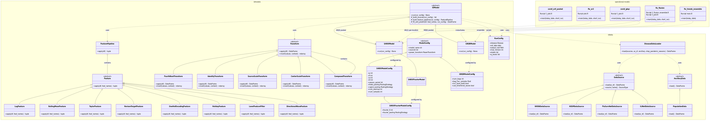

# Architecture Diagram

> Requires Mermaid v10+ for `namespace` support (GitHub, GitLab, Obsidian, most modern renderers).

You can navigate the diagram freely using [Mermaid Live Editor](https://mermaid.live/edit#pako:eNq9WG1v2zYQ_iuE9sVGnKB23o0iQFYvS9A0y-wAG4YAAi3RDjGKVEnKjZvlv-9IWZYoMs4at_uQ2CKfe-6OvDf5KUpESqJhlDCs1IjiucTZPUeI44yoHCcE0TTFGqMns4qQxaERVQQrMoKNa4FTIqtthHYYLHSUKGRCVA9hFYsZfPCEMoblsodSKfI4xzwlGU1iwyO46iLDdQHKSUn07KiDvYllrPW8f4-nSkuc6LMzV7dV6RHCbmlUbFzrdFFJeLfMQxpvLic3Ia2bNLgEk8ntVgQXrJgUcnFD9FY0V9dX21KcV3c3asTBpgvYTHcr8oJhTQV3-TbJwj_z0XDj_T-7u61bCiKcawghQuccwrUP0mDck7Ew1ztL5OXK3t5Zk36ICkXUy1BXS4VuJ2kGecyUm6ZXo09m9ZU7kwXvwF-cCD6j8y66EXydMz_F04KyNF7ls4NjVOk2bkawLiSJc5oTRjlxBC7KzdvVXi07ozqGghDnkqQ00Z0UKoZhsqkKRaRJsim0Jufjqz9bLm9wz5e9ADcpkZaiufnrz7-P38h7JzFXMyGzV24B5zlbguehwkX5gkjdWWBWmOMAjZo86i7iKZYSL0PVAxzRD2MhdED_d9Z1lRKuqV7-eE1lwkwSzMiPV_YBvCLy_1Imslwokv54Task_I_R2MzDLtJFzkIxfo3nHu03UowFg5ow_0Qw35bqDi-ZkNuyXApJvwp-h-Wc6G3JfuPkUuhfOAxb4OT2pjGa4uW2NNdkQdiK5IIy7Uxx30Y1opIkpulh9gdekG0tazWKYC68JGvL9Adbk1-JcdsxrSkI9lpTonLa204uvhAZ63V23prndbJubEVtW3ZyRHnNfOs8pc7TyHkqR-U4J5IKF6cfiMZxLoRJIbDNfk7AWk3my1qezrPXUbzI4i9YZoVrpllWOIMzV_X65gbqOT4rN-OPDnO1utGw52A39jQYK6d4rhwFsBDP4O7X9s9g0tSNEpqwmJlcsNOLQlMwYL0Lw1ac1tENR7MgTYhbxArumZSWM10129XjA5nF8GJFkPm3XhWFzgsdS2jc6BbrhzpY8WP8UJYkNyg0iLeC9XPpTnO1OUVXU6GdV-s49bbWx2x2GqNVLdcel-ruVY7W_hASQHnjQwATavwBWKhlh2DtZmswfgcWAK2fhra5YsrtpF5VOMtXtz9vy29rHsRpV95uqA15oGB7CVA124bvhdcOPEi4zDdg64ptzq4SdU-umbitCCxXg6BWyrsR6bH5VagZ3Pb1y3vTqt_Cmri2X2FUM0pC-3VdGKIcr35haWSUwXju2GODL6A-RdPlWqTpXC0ZKLwBgvo9xgi266gn4L5jCug8uLz93dDbZiIWNI2xPLKlHCieGtWL8o4WEH225vWQgloGZa7g3QozVomkuUb9OGdC740D5bVUMJ9-lt-desYKsHzwNt6NrPCn4MzexjyoxGPCFcmmjFR6asz-Zq-0JDxVa_mX7fCUm32HdtU_vHt2wxfC6HzcOeqicreWsBfnxB1AoSpoDPXfdDEDrS4ixDkATiJ3mUhsGFbw6oRfNaMNbtpRnU-Fax9bO41Nmke9aC5pGg21LEgvyoiEI4PHyJ7xfQRjGbyqRUP4Cq9jf99H9_wZZHLM_xIiq8SkKOYP0XCGmYKnIjd3sfohtoLgQovJkifVMzBEw6foMRru9k8O945Ojg8PDk_2T46P4UsvWkbDfv9o7_Td8cG709PD_cG7_uD4uRd9tVr7gD88POrvnx4dHPT3Byf7YAM4S-QHUXANgEEvIinVwlYT89uw-Xj-F7GGSVQ). 
(If the link expires, just paste the code at the end of this file into a new Mermaid Live document.)

A static PNG of the diagram is shown below and can be found at `./architecture.png` in the project directory.

```mermaid
classDiagram
  namespace iddata {
    class DiseaseDataLoader {
      +load(sources, as_of, ancillary, drop_pandemic_seasons) DataFrame
    }
    class DataSource {
      <<abstract>>
      +load(as_of) DataFrame
      +source_name() SourceType
    }
    class NHSNDataSource {
      +load(as_of) DataFrame
    }
    class NSSPDataSource {
      +load(as_of) DataFrame
    }
    class FluSurvNetDataSource {
      +load(as_of) DataFrame
    }
    class ILINetDataSource {
      +load(as_of) DataFrame
    }
    class AncillaryData {
      <<abstract>>
      +load() DataFrame
    }
    class PopulationData {
      +load() DataFrame
    }
  }

  DataSource <|-- NHSNDataSource
  DataSource <|-- NSSPDataSource
  DataSource <|-- FluSurvNetDataSource
  DataSource <|-- ILINetDataSource
  AncillaryData <|-- PopulationData
  DiseaseDataLoader ..> DataSource : uses
  DiseaseDataLoader ..> AncillaryData : uses

  namespace idmodels {
    class IDModel {
      <<abstract>>
      +run(run_config) None
      #_build_sources(run_config) list
      #_build_feature_pipeline(run_config) FeaturePipeline
      #_fit_and_predict(df, feat_names, run_config) DataFrame
    }
    class SARIXModel {
      +run(run_config) None
    }
    class SARIXFourierModel
    class GBQRModel {
      +run(run_config) None
    }
    class Transform {
      <<abstract>>
      +apply(df) DataFrame
      +invert(values, context) ndarray
    }
    class FourthRootTransform {
      +apply(df) DataFrame
      +invert(values, context) ndarray
    }
    class IdentityTransform {
      +apply(df) DataFrame
      +invert(values, context) ndarray
    }
    class SourceScaleTransform {
      +apply(df) DataFrame
      +invert(values, context) ndarray
    }
    class CenterScaleTransform {
      +apply(df) DataFrame
      +invert(values, context) ndarray
    }
    class ComposedTransform {
      +apply(df) DataFrame
      +invert(values, context) ndarray
    }
    class Feature {
      <<abstract>>
      +apply(df, feat_names) tuple
    }
    class LagFeature {
      +apply(df, feat_names) tuple
    }
    class RollingMeanFeature {
      +apply(df, feat_names) tuple
    }
    class TaylorFeature {
      +apply(df, feat_names) tuple
    }
    class HorizonTargetFeature {
      +apply(df, feat_names) tuple
    }
    class OneHotEncodingFeature {
      +apply(df, feat_names) tuple
    }
    class HolidayFeature {
      +apply(df, feat_names) tuple
    }
    class LevelFeatureFilter {
      +apply(df, feat_names) tuple
    }
    class DirectionalWaveFeature {
      +apply(df, feat_names) tuple
    }
    class FeaturePipeline {
      +apply(df) tuple
    }
    class ModelConfig {
      <<abstract>>
      +model_name str
      +sources list
      +power_transform PowerTransform
    }
    class SARIXModelConfig {
      +p int
      +P int
      +d int
      +D int
      +season_period int
      +theta_pooling PoolingStrategy
      +sigma_pooling PoolingStrategy
      +num_warmup int
      +num_samples int
    }
    class SARIXFourierModelConfig {
      +fourier_K int
      +fourier_pooling PoolingStrategy
    }
    class GBQRModelConfig {
      +num_bags int
      +bag_frac_samples float
      +incl_level_feats bool
      +use_directional_waves bool
    }
    class RunConfig {
      +disease Disease
      +ref_date date
      +output_root Path
      +max_horizon int
      +states list
      +q_levels list
    }
  }

  IDModel <|-- SARIXModel
  IDModel <|-- GBQRModel
  SARIXModel <|-- SARIXFourierModel
  Transform <|-- FourthRootTransform
  Transform <|-- IdentityTransform
  Transform <|-- SourceScaleTransform
  Transform <|-- CenterScaleTransform
  Transform <|-- ComposedTransform
  ComposedTransform o-- Transform : contains
  Feature <|-- LagFeature
  Feature <|-- RollingMeanFeature
  Feature <|-- TaylorFeature
  Feature <|-- HorizonTargetFeature
  Feature <|-- OneHotEncodingFeature
  Feature <|-- HolidayFeature
  Feature <|-- LevelFeatureFilter
  Feature <|-- DirectionalWaveFeature
  FeaturePipeline o-- Feature : contains
  ModelConfig <|-- SARIXModelConfig
  ModelConfig <|-- GBQRModelConfig
  SARIXModelConfig <|-- SARIXFourierModelConfig
  IDModel ..> DiseaseDataLoader : uses
  IDModel ..> FeaturePipeline : uses
  IDModel ..> Transform : uses
  IDModel ..> RunConfig : param
  SARIXModel ..> SARIXModelConfig : configured by
  SARIXFourierModel ..> SARIXFourierModelConfig : configured by
  GBQRModel ..> GBQRModelConfig : configured by

  namespace operational-models {
    class covid_ar6_pooled {
      +main(today_date, short_run)
      Rscript 1_plot.R
    }
    class covid_gbqr {
      +main(today_date, short_run)
      Rscript 1_plot.R
    }
    class flu_ar2 {
      +main(today_date, short_run)
      Rscript plot.R
    }
    class flu_flusion {
      +main(today_date, short_run)
      Rscript 2_flusion_ensemble.R
      Rscript 3_plot.R
    }
    class flu_trends_ensemble {
      +main(today_date)
      Rscript main.R
    }
  }

  covid_ar6_pooled ..> SARIXModel : AR(6) pooled
  covid_gbqr ..> GBQRModel : instantiates
  flu_ar2 ..> SARIXModel : AR(2) per-location
  flu_flusion ..> SARIXModel : AR(6) pooled
  flu_flusion ..> GBQRModel : ensemble
  flu_trends_ensemble ..> RunConfig : uses
```

