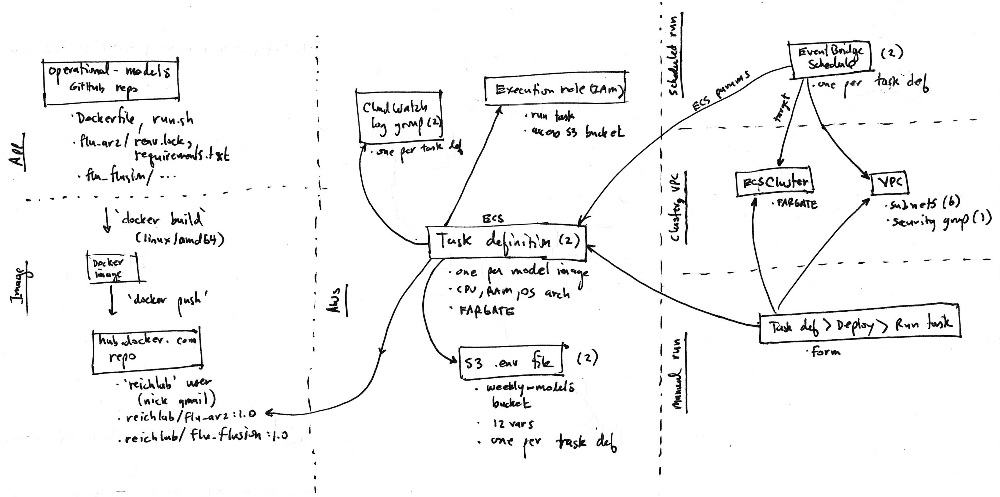

# Project Poster: Use infrastructure as code (IaC) for the lab's operational-models

- Date: 2024-12-19
- Owner: reichlab
- Team: Becky, Evan, Matt, Nick, Zhian
- Status: draft

## Problem description

The [https://github.com/reichlab/operational-models](operational-models) repo contains our latest effort at automating Reichlab models via Docker containers. We currently have two models ([flu_ar2](https://github.com/reichlab/operational-models/tree/main/flu_ar2) and [flu_flusion](https://github.com/reichlab/operational-models/tree/main/flu_flusion)) with more to come. Right now our models run on an AWS infrastructure (see [Current infrastructure](#current-infrastructure) below) that:

- was handbuilt via the AWS console
- is undocumented
- is only understood by one or two lab members
- likely could be cleaned up (e.g., removing the security group's inbound SSH/22 rule)

This situation exposes some risks to the lab with respect to understanding and managing the AWS setup. (TODO list risks)

## Project goal

Our goal is to: 1) enumerate possible solutions to implementing a documented way to enumerate and manage AWS resources (ideally one that generates a log or trail of changes over time), 2) evaluate and choose the best that meets our needs, and 3) implement that choice.

## What are possible solutions?

So far we envision these possible solutions:

- keep using the AWS console to create and update cloud resources; create documentation about what each component is used for, including a changelog
- a script that creates resources via AWS CLI or API
- full on IAC solution such as https://www.pulumi.com/ or an AWS-based one (there seems to be many - see https://aws.amazon.com/what-is/iac/ )

## Evaluation approach

Once we've enumerated possible solutions then we will evaluate them to choose the best for us. The choice should balance:

- features (must meet our needs)
- learning curve (solutions that leverage lab experience are better)
- cost (lower cost solutions are better)
- understandability to lab members (more understandable solutions are better)

After that we will implement the chosen solution by creating a working infrastructure to "dry run" our flu_ar2 model and then judging how it went, both process and end product. Details: Write python code located in a https://github.com/reichlab/operational-models `pulumi` branch under a `infrastructure` dir (say) that runs this container:

- image: [reichlab/flu_ar2:1.0](https://hub.docker.com/repository/docker/reichlab/flu_ar2/general)
- `docker run` environment variables: same as [weekly-models/flu_ar2.env](https://us-east-1.console.aws.amazon.com/s3/object/weekly-models?region=us-east-1&bucketType=general&prefix=flu_ar2.env), except:
    - `CHANNEL_ID=C02UELXDPQQ`  # "#tmp" channel
    - `DRY_RUN=1`  # enabled

## Current infrastructure

 gives an overview of the AWS resources currently used to run our models.

TODO: Details about each box in the diagram?

MUS: here's a partial description from slack:

- Docker image: I've built and pushed an AWS-compatiable image to dockerhub: reichlab/flu_ar2:1.0. It implements the generalized scheme you and I discussed yesterday where the same Dockerfile and run.sh can apply to different models ( https://github.com/reichlab/operational-models ). Recall that it's parameterized via environment variables passed on the command line (local dev) or in a .env file (local dev or AWS).
- ECS cluster: Configures AWS_Fargate (serverless container running) to run ECS task definitions (i.e., container images). I use this cluster for all lab task definitions. weekly-models
- Task definition for the flu_ar2 model: Specifies the above Docker image, an S3 environment file for it, logging, and how to run it including cpu, memory, and OS. flu-ar2-model:3 . Looking at the JSON might be useful.
- Task execution role: Permits the task to execute and to access the S3 env file. ecsTaskExecutionRole
- Environment file for the task: An S3 object that's input to the above task definition. Includes all the variables required by our operational-models Dockerfile and run.sh setup. flu_ar2.env.
- EventBridge schedule: A cron-style schedule for executing the task. flu-ar2-model
